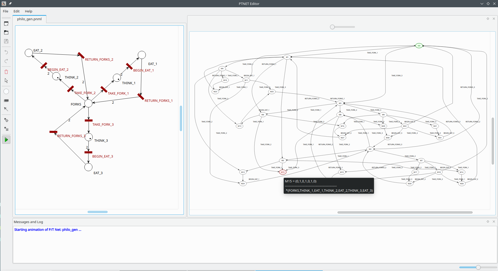
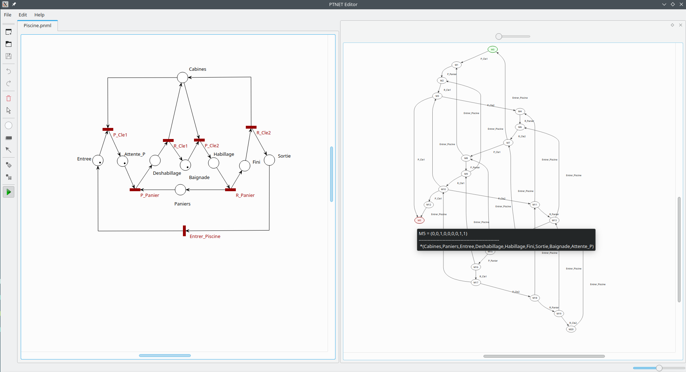

PTNET-Editor
============

A place/Transition net Editor based on the [**PNML**](https://www.pnml.org) metamodels.



Required libraries
------------------

Tested on **OpenSUSE LEAP 15.5** with **Qt5** with following requirements:

- QT modules: [QT += core gui xml xmlpatterns widgets](https://github.com/MagonBC/ptneteditor/blob/main/ptnet.pro#L7)
- [libboost_graph1_66_0](https://www.boost.org/) for coverability graph search, creation and export in dot format (graph.dot)
- GraphViz library to parse graph.dot file and visualize the graph 

Compile and run
---------------

```shell
$> cd schemas && ./prepare_schemas.sh
$> ls schemas
anyElement  anyElement.rng.xsd  conventions.rng.xsd  pnmlcoremodel.rng.xsd  prepare_schemas.sh  ptnet.xsd
$>
$> qmake-qt5
$> make call
$> ./build/ptnet
```

Examples
--------

Some examples are listed in [Examples section](https://www.pnml.org/version-2009/version-2009.php) but no pnml document format is provided.

Under the examples directory we provide some Place/Transition net used to modulate some common systems and problems:

**Dining Philosophers Problem**

A three philosophers representation of Edgar Dijkstra's famous [Dining Philosophers Problem](https://en.wikipedia.org/wiki/[Diningphilosophers_problem).
A deadlock (M15) happens when each philosopher holds only one fork. Consequently, they will starve !

**Swimming Pool deadlock**

A deadlock when simultaneously we have:
- A swimmer is stucked in the cabine and has the bascket (panier). To get out he needs the key to open the cabine!
- A second swimmer has the key (cle) but it doesn't have the bascket. So it can't bathe (baignade) !



Nice !